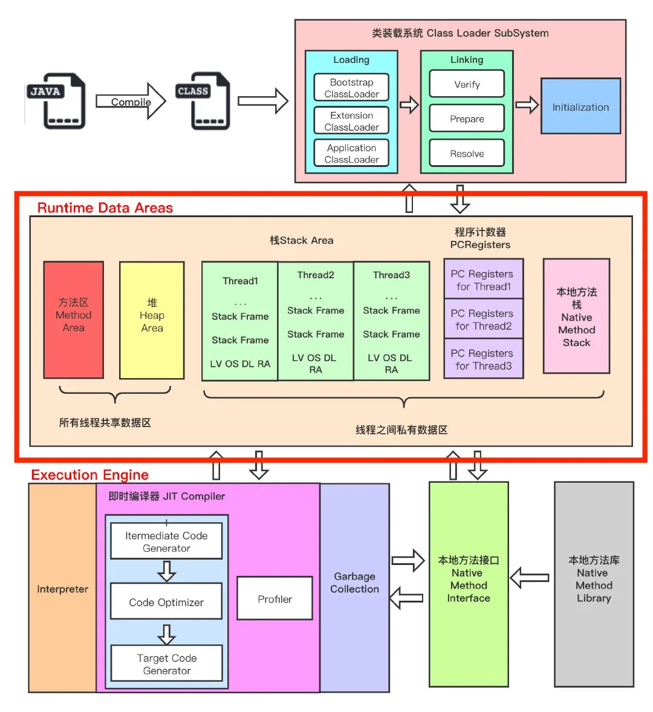

# JVM运行时数据区

## 目录

- [概述](#概述)
- [1. 程序计数器](#1-程序计数器)
  - [1.1 作用](#11-作用)
  - [1.2 概述](#12-概述)
- [2. 虚拟机栈](#2-虚拟机栈)
  - [2.1 概述](#21-概述)
  - [2.2 栈的存储单位](#22-栈的存储单位)
  - [2.3 栈的运行原理](#23-栈的运行原理)
  - [2.4 栈帧的内部结构](#24-栈帧的内部结构)
    - [2.4.1 局部变量表](#241-局部变量表)
    - [2.4.2 操作数栈](#242-操作数栈)
    - [2.4.3 动态链接](#243-动态链接指向运行时常量池的方法引用)
    - [2.4.4 方法返回地址](#244-方法返回地址)
    - [2.4.5 附加信息](#245-附加信息)
- [3. 本地方法栈](#3-本地方法栈)
  - [3.1 本地方法接口](#31-本地方法接口)
  - [3.2 本地方法栈](#32-本地方法栈Native-Method-Stack)
- [4. 堆内存](#4-堆内存)
  - [4.1 内存划分](#41-内存划分)
    - [4.1.1 年轻代](#411-年轻代Young-Generation)
    - [4.1.2 老年代](#412-老年代Old-Generation)
    - [4.1.3 元空间](#413-元空间)
  - [4.2 设置堆内存大小和OOM](#42-设置堆内存大小和OOM)
    - [4.2.1 查看JVM堆内存分配](#421-查看JVM堆内存分配)
  - [4.3 对象在堆中的生命周期](#43-对象在堆中的生命周期)
  - [4.4 对象的分配过程](#44-对象的分配过程)
  - [4.5 GC垃圾回收简介](#45-GC垃圾回收简介)
    - [4.5.1 Minor GC、Major GC、Full GC](#451-Minor-GCMajor-GCFull-GC)
  - [4.6 TLAB](#46-TLAB)
    - [4.6.1 什么是TLAB?](#461-什么是TLABThread-Local-Allocation-Buffer)
    - [4.6.2 为什么要有TLAB?](#462-为什么要有TLAB)
  - [4.7 堆是分配对象存储的唯一选择吗](#47-堆是分配对象存储的唯一选择吗)
    - [4.7.1 逃逸分析](#471-逃逸分析)
    - [4.7.2 参数设置](#472-参数设置)
    - [4.7.3 代码优化之同步省略](#473-代码优化之同步省略锁消除)
    - [4.7.4 代码优化之标量替换](#474-代码优化之标量替换)
    - [4.7.5 代码优化之栈上分配](#475-代码优化之栈上分配)
    - [4.7.6 总结](#476-总结)
- [5. 方法区](#5-方法区)
  - [5.1 解惑](#51-解惑)
  - [5.2 设置方法区内存的大小](#52-设置方法区内存的大小)
  - [5.3 方法区内部结构](#53-方法区内部结构)
    - [5.3.1 类型信息](#531-类型信息)
    - [5.3.2 域信息](#532-域Field信息)
    - [5.3.3 方法信息](#533-方法Method信息)
    - [5.3.4 栈、堆、方法区的交互关系](#534-栈堆方法区的交互关系)
  - [5.4 运行时常量池](#54-运行时常量池)
    - [5.4.1 常量池](#541-常量池)
    - [5.4.2 运行时常量池](#542-运行时常量池)
  - [5.5 方法区在 JDK6、7、8中的演进细节](#55-方法区在JDK678中的演进细节)
    - [5.5.1 移除永久代原因](#551-移除永久代原因)
  - [5.6 方法区的垃圾回收](#56-方法区的垃圾回收)
- [参考](#参考)

## 概述


内存是非常重要的系统资源，是硬盘和CPU的中间仓库及桥梁，承载着操作系统和应用程序的实时运行。JVM内存布局规定了Java在运行过程中内存申请、分配、管理的策略，保证了JVM的高效稳定运行。不同的JVM对于内存的划分方式和管理机制存在着部分差异。

下图是JVM整体架构，中间部分就是Java虚拟机定义的各种运行时数据区域。



Java虚拟机定义了若干种程序运行期间会使用到的运行时数据区，其中有一些会随着虚拟机启动而创建，随着虚拟机退出而销毁。另外一些则是与线程一一对应的，这些与线程一一对应的数据区域会随着线程开始和结束而创建和销毁。

- 线程私有：程序计数器、栈、本地栈
- 线程共享：堆、堆外内存(永久代或元空间、代码缓存)

## 1. 程序计数器
**程序计数寄存器**(`Program Counter Register`)，Register的命名源于CPU的寄存器，寄存器存储指令相关的线程信息，CPU只有把数据装载到寄存器才能够运行。

这里，并非是广义上所指的物理寄存器，叫程序计数器(或PC计数器或指令计数器)会更加贴切，并且也不容易引起一些不必要的误会。**JVM中的PC寄存器是对物理PC寄存器的一种抽象模拟**。

程序计数器是一块较小的内存空间，可以看作是当前线程所执行的字节码的**行号指示器**。

### 1.1 作用
PC寄存器用来存储指向下一条指令的地址，即将要执行的指令代码，由执行引擎读取下一条指令。


分析：进入class文件所在目录，执行`javap -v xx.class`反解析(或者通过IDEA插件jclasslib直接查看，上图)，可以看到当前类对应的Code区(汇编指令)、本地变量表、异常表和代码行偏移量映射表、常量池等信息。

### 1.2 概述

- 它是一块很小的内存空间，几乎可以忽略不计，也是运行速度最快的存储区域。
- 在JVM规范中，每个线程都有它自己的程序计数器，是**线程私有**的，生命周期与线程的生命周期一致。
- 任何时间一个线程都只有一个方法在执行，也就是所谓的当前方法。如果当前线程正在执行的是Java方法，程序计数器记录的是JVM字节码指令地址，如果是执行native方法，则是未指定值(undefined)。
- 它是程序控制流的指示器，分支、循环、跳转、异常处理、线程恢复等基础功能都需要依赖这个计数器来完成。
- 字节码解释器工作时就是通过改变这个计数器的值来选取下一条需要执行的字节码指令。
- 它是**唯一一个**在JVM规范中没有规定任何OutOfMemoryError情况的区域。

> 使用PC寄存器存储字节码指令地址有什么用呢？为什么使用PC寄存器记录当前线程的执行地址呢？
>
> 因为CPU需要不停的切换各个线程，这时候切换回来以后，就得知道接着从哪开始继续执行。JVM的字节码解释器就需要通过改变PC寄存器的值来明确下一条应该执行什么样的字节码指令。

> PC寄存器为什么会被设定为线程私有的？
>
> 多线程在一个特定的时间段内只会执行其中某一个线程方法，CPU会不停的做任务切换，这样必然会导致经常中断或恢复。为了能够准确的记录各个线程正在执行的当前字节码指令地址，所以为每个线程都分配了一个PC寄存器，每个线程都独立计算，不会互相影响。

## 2. 虚拟机栈
### 2.1 概述
**Java虚拟机栈**(`Java Virtual Machine Stacks`)，早期也叫Java栈。每个线程在创建的时候都会创建一个虚拟机栈，其内部保存一个个的**栈帧**(`Stack Frame`)，对应着一次次Java方法调用，是**线程私有**的，生命周期和线程一致。

作用：主管Java程序的运行，它保存方法的局部变量、部分结果，并参与方法的调用和返回。

特点：

- 栈是一种快速有效的分配存储方式，访问速度仅次于程序计数器。
- JVM直接对虚拟机栈的操作只有两个：每个方法执行，伴随着**入栈**(进栈/压栈)，方法执行结束**出栈**。
- **栈不存在垃圾回收问题**。

栈中可能出现的异常：

Java虚拟机规范允许Java虚拟机栈的**大小是动态的或者是固定不变的**。

- 如果采用固定大小的Java虚拟机栈，那每个线程的Java虚拟机栈容量可以在线程创建的时候独立选定。如果线程请求分配的栈容量超过Java虚拟机栈允许的最大容量，Java虚拟机将会抛出一个StackOverflowError异常。
- 如果Java虚拟机栈可以动态扩展，并且在尝试扩展的时候无法申请到足够的内存，或者在创建新的线程时没有足够的内存去创建对应的虚拟机栈，那Java虚拟机将会抛出一个OutOfMemoryError异常。

可以通过参数`-Xss`来设置线程的最大栈空间，栈的大小直接决定了函数调用的最大可达深度。

### 2.2 栈的存储单位
栈中存储什么？

- 每个线程都有自己的栈，栈中的数据都是以**栈帧**(`Stack Frame`)的格式存在。
- 在这个线程上正在执行的每个方法都各自有对应的一个栈帧。
- 栈帧是一个内存区块，是一个数据集，维系着方法执行过程中的各种数据信息。

### 2.3 栈的运行原理

- JVM直接对Java栈的操作只有两个，对栈帧的**压栈**和**出栈**，遵循“**先进后出/后进先出**”原则
- 在一条活动线程中，一个时间点上，只会有一个活动的栈帧。即只有当前正在执行的方法的栈帧(栈顶栈帧)是有效的，这个栈帧被称为当前栈帧(`Current Frame`)，与当前栈帧对应的方法就是当前方法(`Current Method`)，定义这个方法的类就是当前类(`Current Class`)。
- 执行引擎运行的所有字节码指令只针对当前栈帧进行操作。
- 如果在该方法中调用了其他方法，对应的新的栈帧会被创建出来，放在栈的顶端，成为新的当前栈帧。
- 不同线程中所包含的栈帧是**不允许存在相互引用**的，即不能在一个栈帧中引用另外一个线程的栈帧。
- 如果当前方法调用了其他方法，方法返回之际，当前栈帧会传回此方法的执行结果给前一个栈帧，接着，虚拟机会丢弃当前栈帧，使得前一个栈帧重新成为当前栈帧。
- Java方法有两种返回函数的方式，一种是**正常的函数返回**，使用return指令，另一种是**抛出异常**，不管用哪种方式，都会导致栈帧被弹出。

IDEA在Debug时候，可以在Debug窗口看到Frames中各种方法的压栈和出栈情况：


### 2.4 栈帧的内部结构
每个栈帧(`Stack Frame`)中存储着：

- 局部变量表(`Local Variables`)
- 操作数栈(`Operand Stack`)(或称为表达式栈)
- 动态链接(`Dynamic Linking`)：指向运行时常量池的方法引用
- 方法返回地址(`Return Address`)：方法正常退出或异常退出的地址
- 一些附加信息


#### 2.4.1 局部变量表

- 局部变量表也被称为局部变量数组或者本地变量表。
- 是一组变量值存储空间，主要用于存储方法参数和定义在方法体内的局部变量，包括编译器可知的各种Java虚拟机**基本数据类型**(boolean、byte、char、short、int、float、long、double)、**对象引用**(reference类型，它并不等同于对象本身，可能是一个指向对象起始地址的引用指针，也可能是指向一个代表对象的句柄或其他与此相关的位置)和**returnAddress类型**(指向了一条字节码指令的地址，已被异常表取代)。
- 由于局部变量表是建立在线程的栈上，是**线程的私有数据**，因此**不存在数据安全问题**。
- 局部变量表所需要的容量大小是**编译期确定**下来的，并保存在方法的Code属性的`maximum local variables`数据项中。在方法运行期间是不会改变局部变量表的大小的。
- 方法嵌套调用的次数由栈的大小决定。一般来说，**栈越大，方法嵌套调用次数越多**。对一个函数而言，它的参数和局部变量越多，使得局部变量表膨胀，它的栈帧就越大，以满足方法调用所需传递的信息增大的需求。进而函数调用就会占用更多的栈空间，导致其嵌套调用次数就会减少。
- 局部变量表中的变量只在当前方法调用中有效。在方法执行时，虚拟机通过使用局部变量表完成参数值到参数变量列表的传递过程。当方法调用结束后，随着方法栈帧的销毁，局部变量表也会随之销毁。
- 参数值的存放总是在局部变量数组的index0开始，到数组长度-1的索引结束。

##### 槽 Slot

- 局部变量表最基本的存储单元是**变量槽**(`Slot`)。
- 在局部变量表中，32位以内的类型只占用一个Slot(包括returnAddress类型)，64位的类型(long和double)占用两个连续的Slot。
  - byte、short、char在存储前被转换为int，boolean也被转换为int，0表示false，非0表示true
  - long和double则占据两个Slot
- JVM会为局部变量表中的每一个Slot都分配一个访问索引，通过这个索引即可成功访问到局部变量表中指定的局部变量值，索引值的范围从0开始到局部变量表最大的Slot数量。
- 当一个实例方法被调用的时候，它的方法参数和方法体内部定义的局部变量将会按照顺序被复制到局部变量表中的每一个Slot上。
- 如果需要访问局部变量表中一个64bit的局部变量值时，只需要使用前一个索引即可。(比如：访问long或double类型变量，不允许采用任何方式单独访问其中的某一个Slot)
- 如果当前帧是由构造方法或实例方法创建的，那么该对象引用this将会存放在index为0的Slot处，其余的参数按照参数表顺序继续排列。(这里就引出一个问题：静态方法中为什么不可以引用this，就是因为this变量不存在于当前方法的局部变量表中)
- 栈帧中的局部变量表中的槽位是可以重用的，如果一个局部变量过了其作用域，那么在其作用域之后申明的新的局部变量就很有可能会复用过期局部变量的槽位，从而达到节省资源的目的。(下图中，this、a、b、c理论上应该有4个变量，c复用了b的槽)


- 在栈帧中，与性能调优关系最为密切的就是局部变量表。在方法执行时，虚拟机使用局部变量表完成方法的传递。
- 局部变量表中的变量也是重要的垃圾回收根节点，只要被局部变量表中直接或间接引用的对象都不会被回收。

#### 2.4.2 操作数栈

- 每个独立的栈帧中除了包含局部变量表之外，还包含一个后进先出(Last-In-First-Out)的**操作数栈**，也可以称为**表达式栈**(`Expression Stack`)。
- 操作数栈，在方法执行过程中，根据字节码指令，往操作数栈中写入数据或提取数据，即**入栈**(push)、**出栈**(pop)。
- 某些字节码指令将值压入操作数栈，其余的字节码指令将操作数取出栈。使用它们后再把结果压入栈。比如，执行复制、交换、求和等操作。

##### 概述

- 操作数栈，主要用于保存计算过程的中间结果，同时作为计算过程中变量临时的存储空间。
- 操作数栈就是JVM执行引擎的一个工作区，当一个方法刚开始执行的时候，一个新的栈帧也会随之被创建出来，此时这个方法的操作数栈是空的。
- 每一个操作数栈都会拥有一个明确的栈深度用于存储数值，**其所需的最大深度在编译期就定义好了**，保存在方法的Code属性的`max_stack`数据项中。
- 栈中的任何一个元素都可以是任意的Java数据类型。
  - 32bit的类型占用一个栈单位深度
  - 64bit的类型占用两个栈单位深度
- 操作数栈并非采用访问索引的方式来进行数据访问的，而是**只能通过标准的入栈和出栈操作**来完成一次数据访问。
- 如果被调用的方法带有返回值的话，其返回值将会被压入当前栈帧的操作数栈中，并更新PC寄存器中下一条需要执行的字节码指令。
- 操作数栈中元素的数据类型必须与字节码指令的序列严格匹配，这由编译器在编译期间进行验证，同时在类加载过程中的类检验阶段的数据流分析阶段要再次验证。
- 另外，我们说Java虚拟机的解释引擎是**基于栈的执行引擎**，其中的栈指的就是操作数栈。

##### 栈顶缓存(Top-of-stack-Cashing)
HotSpot的执行引擎采用的并非是基于寄存器的架构，但这并不代表HotSpot VM的实现并没有间接利用到寄存器资源。寄存器是物理CPU中的组成部分之一，它同时也是CPU中非常重要的高速存储资源。一般来说，寄存器的读/写速度非常迅速，甚至可以比内存的读/写速度快上几十倍不止，不过寄存器资源却非常有限，不同平台下的CPU寄存器数量是不同和不规律的。**寄存器主要用于缓存本地机器指令、数值和下一条需要被执行的指令地址等数据**。

基于栈式架构的虚拟机所使用的零地址指令更加紧凑，但完成一项操作的时候必然需要使用更多的入栈和出栈指令，这同时也就意味着将需要更多的**指令分派**(`Instruction Dispatch`)次数和内存读/写次数。由于操作数是存储在内存中的，因此频繁的执行内存读/写操作必然会影响执行速度。为了解决这个问题，HotSpot JVM设计者们提出了**栈顶缓存**技术，将栈顶元素全部缓存在物理CPU的寄存器中，以此降低对内存的读/写次数，提升执行引擎的执行效率

#### 2.4.3 动态链接(指向运行时常量池的方法引用)

- 每一个栈帧内部都包含一个指向运行时常量池中该栈帧所属方法的引用。包含这个引用的目的就是为了支持当前方法的代码能够实现**动态链接**(`Dynamic Linking`)。
- 在Java源文件被编译到字节码文件中时，所有的变量和方法引用都作为**符号引用**(`Symbolic Reference`)保存在Class文件的常量池中。比如：描述一个方法调用了另外的其他方法时，就是通过常量池中指向方法的符号引用来表示的，那么动态链接的作用就是为了将这些符号引用转换为调用方法的直接引用。


##### JVM是如何执行方法调用的
方法调用不同于方法执行，方法调用阶段的唯一任务就是确定被调用方法的版本(即调用哪一个方法)，暂时还不涉及方法内部的具体运行过程。Class文件的编译过程中不包括传统编译器中的连接步骤，一切方法调用在Class文件里面存储的都是符号引用，而不是方法在实际运行时内存布局中的入口地址(直接引用)，也就是需要在类加载阶段，甚至到运行期才能确定目标方法的直接引用。

在JVM中，将符号引用转换为调用方法的直接引用与方法的绑定机制有关。

- **静态链接**：当一个字节码文件被装载进JVM内部时，如果被调用的目标方法在编译期可知，且运行期保持不变时。这种情况下将调用方法的符号引用转换为直接引用的过程称之为静态链接。
- **动态链接**：如果被调用的方法在编译期无法被确定下来，也就是说，只能在程序运行期将调用方法的符号引用转换为直接引用，由于这种引用转换过程具备动态性，因此也就被称之为动态链接。

对应的方法的绑定机制为：**早期绑定**(`Early Binding`)和**晚期绑定**(`Late Binding`)。绑定是一个字段、方法或者类在符号引用被替换为直接引用的过程，这仅仅发生一次。

- 早期绑定：早期绑定就是指被调用的目标方法如果在编译期可知，且运行期保持不变时，即可将这个方法与所属的类型进行绑定，这样一来，由于明确了被调用的目标方法究竟是哪一个，因此也就可以使用静态链接的方式将符号引用转换为直接引用。
- 晚期绑定：如果被调用的方法在编译器无法被确定下来，只能够在程序运行期根据实际的类型绑定相关的方法，这种绑定方式就被称为晚期绑定。

##### 虚方法和非虚方法

- 如果方法在编译器就确定了具体的调用版本，这个版本在运行时是不可变的。这样的方法称为非虚方法，比如静态方法、私有方法、final方法、实例构造器、父类方法都是非虚方法。
- 其他方法称为虚方法。

##### 虚方法表
在面向对象编程中，会频繁的使用到动态分派，如果每次动态分派都要重新在类的方法元数据中搜索合适的目标有可能会影响到执行效率。为了提高性能，JVM采用在类的方法区建立一个虚方法表(`Virtual Method Table`)，使用索引表来代替查找。非虚方法不会出现在表中。

每个类中都有一个虚方法表，表中存放着各个方法的实际入口。

虚方法表会在类加载的连接阶段被创建并开始初始化，类的变量初始值准备完成之后，JVM会把该类的方法表也初始化完毕。

#### 2.4.4 方法返回地址
用来存放调用该方法的PC寄存器的值。

一个方法的结束，有两种方式：

- 正常执行完成
- 出现未处理的异常，非正常退出

无论通过哪种方式退出，在方法退出后都返回到该方法被调用的位置。方法正常退出时，调用者的PC计数器的值作为返回地址，即调用该方法的指令的下一条指令的地址。而通过异常退出的，返回地址是要通过异常表来确定的，栈帧中一般不会保存这部分信息。

当一个方法开始执行后，只有两种方式可以退出这个方法：

1. 执行引擎遇到任意一个方法返回的字节码指令，会有返回值传递给上层的方法调用者，简称**正常完成出口**。

   一个方法的正常调用完成之后究竟需要使用哪一个返回指令还需要根据方法返回值的实际数据类型而定。

   在字节码指令中，返回指令包含`ireturn`(当返回值是boolean、byte、char、short和int类型时使用)、`lreturn`(返回值是long)、`freturn`(返回值是float)、`dreturn`(返回值是double)以及`areturn`(返回值是引用类型)，另外还有一个`return`指令供声明为void的方法、实例初始化方法、类和接口的初始化方法使用。

2. 在方法执行的过程中遇到了异常，并且这个异常没有在方法内进行处理，也就是只要在本方法的异常表中没有搜索到匹配的异常处理器，就会导致方法退出，简称**异常完成出口**。

   方法执行过程中抛出异常时的异常处理，存储在一个异常处理表，方便在发生异常的时候找到处理异常的代码。

本质上，**方法的退出就是当前栈帧出栈的过程**。此时，需要恢复上层方法的局部变量表、操作数栈、将返回值压入调用者栈帧的操作数栈、设置PC寄存器值等，让调用者方法继续执行下去。

正常完成出口和异常完成出口的区别在于：通过异常完成出口退出的不会给他的上层调用者产生任何的返回值。

#### 2.4.5 附加信息
栈帧中还允许携带与Java虚拟机实现相关的一些附加信息。例如，对程序调试提供支持的信息，但这些信息取决于具体的虚拟机实现。

## 3. 本地方法栈
### 3.1 本地方法接口
简单的讲，一个Native Method就是一个Java调用非Java代码的接口。我们知道的Unsafe类就有很多本地方法。

> 为什么要使用本地方法(Native Method)?

Java使用起来非常方便，然而有些层次的任务用Java实现起来也不容易，或者我们对程序的效率很在意时，问题就来了。

- 与Java环境外交互：有时Java应用需要与Java外面的环境交互，这就是本地方法存在的原因。
- 与操作系统交互：JVM支持Java语言本身和运行时库，但是有时仍需要依赖一些底层系统的支持。通过本地方法，我们可以实现用Java与实现了jre的底层系统交互，JVM的一些部分就是C语言写的。
- Sun's Java：Sun的解释器就是C实现的，这使得它能像一些普通的C一样与外部交互。jre大部分都是用Java实现的，它也通过一些本地方法与外界交互。比如，类java.lang.Thread的setPriority()的方法是用Java实现的，但它实现调用的是该类的本地方法setPriority()，该方法是C实现的，并被植入JVM内部。

### 3.2 本地方法栈(Native Method Stack)

- Java虚拟机栈用于管理Java方法的调用，而本地方法栈用于管理本地方法的调用。
- 本地方法栈也是**线程私有**的。
- 允许线程**固定或者可动态扩展**的内存大小。
  - 如果线程请求分配的栈容量超过本地方法栈允许的最大容量，Java虚拟机将会抛出一个StackOverflowError异常。
  - 如果本地方法栈可以动态扩展，并且在尝试扩展的时候无法申请到足够的内存，或者在创建新的线程时没有足够的内存去创建对应的本地方法栈，那么Java虚拟机将会抛出一个OutOfMemoryError异常。
- 本地方法是使用C语言实现的。
- 它的具体做法是Native Method Stack中登记native方法，在Execution Engine执行时加载本地方法库当某个线程调用一个本地方法时，它就进入了一个全新的并且不再受虚拟机限制的世界。它和虚拟机拥有同样的权限。
- 本地方法可以通过本地方法接口来访问虚拟机内部的运行时数据区，它甚至可以直接使用本地处理器中的寄存器，直接从本地内存的堆中分配任意数量的内存。
- 并不是所有JVM都支持本地方法。因为Java虚拟机规范并没有明确要求本地方法栈的使用语言、具体实现方式、数据结构等。如果JVM产品不打算支持native方法，也可以无需实现本地方法栈。
- 在Hotspot JVM中，直接将本地方栈和虚拟机栈合二为一。

> 栈是运行时的单位，而堆是存储的单位。
>
> 栈解决程序的运行问题，即程序如何执行，或者说如何处理数据。堆解决的是数据存储的问题，即数据怎么放、放在哪。

## 4. 堆内存
### 4.1 内存划分
对于大多数应用，Java堆是Java虚拟机管理的内存中最大的一块，被所有线程共享。此内存区域的唯一目的就是**存放对象实例**，几乎所有的对象实例以及数据都在这里分配内存。

为了进行高效的垃圾回收，虚拟机把堆内存逻辑上划分成三块区域(分代的唯一理由就是优化GC性能)：

- 年轻代：新对象和没达到一定年龄的对象都在新生代。
- 老年代：被长时间使用的对象，老年代的内存空间应该要比年轻代更大。
- 元空间(JDK1.8之前叫永久代)：像一些方法中的操作临时对象等，JDK1.8之前是占用JVM内存，JDK1.8之后直接使用物理内存。


Java虚拟机规范规定，Java堆可以是处于物理上不连续的内存空间中，只要逻辑上是连续的即可，像磁盘空间一样。实现时，**既可以是固定大小，也可以是可扩展的**，主流虚拟机都是可扩展的(通过`-Xmx`和`-Xms`控制)，如果堆中没有完成实例分配，并且堆无法再扩展时，就会抛出OutOfMemoryError异常。

#### 4.1.1 年轻代(Young Generation)
年轻代是所有新对象创建的地方。当填充年轻代时，执行垃圾收集。这种垃圾收集称为`Minor GC`。年轻一代被分为三个部分——**新生区**(`Eden Memory`)和两个**幸存区**(`Survivor Memory`，被称为from/to或s0/s1)，默认比例是8:1:1。

- 大多数新创建的对象都位于Eden内存空间中。
- 当Eden空间被对象填充时，执行Minor GC，并将所有幸存者对象移动到一个幸存区空间中。
- Minor GC检查幸存者对象，并将它们移动到另一个幸存区空间。所以每次，一个幸存区空间总是空的。
- 经过多次GC循环后存活下来的对象被移动到老年代。通常，这是通过设置年轻一代对象的年龄阈值来实现的，然后他们才有资格提升到老年代。

#### 4.1.2 老年代(Old Generation)
旧的一代内存包含那些经过许多轮小型GC后仍然存活的对象。通常，垃圾收集是在老年代内存满时执行的。老年代垃圾收集称为`Major GC`，通常需要更长的时间。

大对象直接进入老年代(大对象是指需要大量连续内存空间的对象)。这样做的目的是避免在Eden区和两个Survivor区之间发生大量的内存拷贝。

#### 4.1.3 元空间
不管是JDK8之前的永久代，还是JDK8及以后的元空间，都可以看作是Java虚拟机规范中方法区的实现。

虽然Java虚拟机规范把方法区描述为堆的一个逻辑部分，但是它却有一个别名叫`Non-Heap`(非堆)，目的应该是与Java堆区分开。

所以元空间放在后边的方法区再说。

### 4.2 设置堆内存大小和OOM
Java堆用于存储Java对象实例，那么堆的大小在JVM启动的时候就确定了，我们可以通过`-Xmx`和`-Xms`来设定：

- `-Xms`用来表示堆的起始内存，等价于`-XX:InitialHeapSize`
- `-Xmx`用来表示堆的最大内存，等价于`-XX:MaxHeapSize`

如果堆的内存大小超过`-Xmx`设定的最大内存， 就会抛出OutOfMemoryError异常。

我们通常会将`-Xmx`和`-Xms`两个参数配置为相同的值，其目的是为了能够在垃圾回收机制清理完堆区后不再需要重新分隔计算堆的大小，从而提高性能。

- 默认情况下，初始堆内存大小为：电脑内存大小/64
- 默认情况下，最大堆内存大小为：电脑内存大小/4

可以通过代码获取到我们的设置值，当然也可以模拟OOM：

```
public static void main(String[] args) {

  //返回JVM堆大小
  long initialMemory = Runtime.getRuntime().totalMemory() / 1024 /1024;
  //返回JVM堆的最大内存
  long maxMemory = Runtime.getRuntime().maxMemory() / 1024 /1024;

  System.out.println("-Xms : " + initialMemory + "M");
  System.out.println("-Xmx : " + maxMemory + "M");

  System.out.println("系统内存大小：" + initialMemory * 64 / 1024 + "G");
  System.out.println("系统内存大小：" + maxMemory * 4 / 1024 + "G");
}
```

#### 4.2.1 查看JVM堆内存分配

1. 在默认不配置JVM堆内存大小的情况下，JVM根据默认值来配置当前内存大小。
2. 默认情况下新生代和老年代的比例是1:2，可以通过`–XX:NewRatio`来配置。

   - 新生代中的Eden:From Survivor:To Survivor的比例是 8:1:1，可以通过`-XX:SurvivorRatio`来配置。

3. 若在JDK 7中开启了`-XX:+UseAdaptiveSizePolicy`，JVM会动态调整JVM堆中各个区域的大小以及进入老年代的年龄。

   此时`–XX:NewRatio`和`-XX:SurvivorRatio`将会失效，而JDK 8是默认开启`-XX:+UseAdaptiveSizePolicy`。

   在JDK 8中，不要随意关闭`-XX:+UseAdaptiveSizePolicy`，除非对堆内存的划分有明确的规划。

每次GC后都会重新计算Eden、From Survivor、To Survivor的大小。

计算依据是GC过程中统计的GC时间、吞吐量、内存占用量。

```
windows命令：
java -XX:+PrintFlagsFinal -version | findStr HeapSize
    uintx ErgoHeapSizeLimit             = 0            {product}
    uintx HeapSizePerGCThread           = 87241520     {product}
    uintx InitialHeapSize              := 268435456    {product}
    uintx LargePageHeapSizeThreshold    = 134217728    {product}
    uintx MaxHeapSize                  := 4263510016   {product}
java version "1.8.0_102"
Java(TM) SE Runtime Environment (build 1.8.0_102-b14)
Java HotSpot(TM) 64-Bit Server VM (build 25.102-b14, mixed mode)
```

```
linux命令：
java -XX:+PrintFlagsFinal -version | grep HeapSize
```

### 4.3 对象在堆中的生命周期

1. 在JVM内存模型的堆中，堆被划分为**新生代**和**老年代**。

   - 新生代又被进一步划分为Eden区和Survivor区，Survivor区由From Survivor和To Survivor组成。

2. 当创建一个对象时，对象会被优先分配到新生代的Eden区。

   - 此时JVM会给对象定义一个对象年轻计数器(`-XX:MaxTenuringThreshold`)。

3. 当Eden空间不足时，JVM将执行新生代的垃圾回收(Minor GC)。

   - JVM会把存活的对象转移到Survivor中，并且对象年龄+1。
   - 对象在Survivor中同样也会经历Minor GC，每经历一次Minor GC，对象年龄都会+1。

4. 如果分配的对象超过了`-XX:PretenureSizeThreshold`，对象会直接被分配到老年代。

### 4.4 对象的分配过程
为对象分配内存是一件非常严谨和复杂的任务，JVM的设计者们不仅需要考虑内存如何分配、在哪里分配等问题，并且由于内存分配算法和内存回收算法密切相关，所以还需要考虑GC执行完内存回收后是否会在内存空间中产生内存碎片。

1. new的对象先放在新生区，此区有大小限制。
2. 当新生区的空间填满时，程序又需要创建对象，JVM的垃圾回收器将对新生区进行垃圾回收(Minor GC)，将新生区中的不再被其他对象所引用的对象进行销毁，再加载新的对象放到新生区。
3. 然后将新生区中的剩余对象移动到幸存者0区。
4. 如果再次触发垃圾回收，此时上次幸存下来的放到幸存者0区，如果没有回收，就会放到幸存者1区。
5. 如果再次经历垃圾回收，此时会重新放回幸存者0区，接着再去幸存者1区。
6. 什么时候才会去老年代呢？ 默认是15次回收标记。
7. 在老年代，相对悠闲。当老年代内存不足时，再次触发Major GC，进行老年代的内存清理。
8. 若老年代执行了Major GC之后发现依然无法进行对象的保存，就会产生OOM异常。

### 4.5 GC垃圾回收简介
#### 4.5.1 Minor GC、Major GC、Full GC
JVM在进行GC时，并非每次都对堆内存(新生代、老年代、方法区)区域一起回收的，大部分时候回收的都是指新生代。

针对HotSpot VM的实现，它里面的GC按照回收区域又分为两大类：**部分收集**(`Partial GC`)，**整堆收集**(`Full GC`)：

- 部分收集：不是完整收集整个Java堆的垃圾收集。其中又分为：
  - 目前只有G1 GC会有这种行为。
  - 目前，只有CMS GC会有单独收集老年代的行为。
  - 很多时候Major GC会和Full GC混合使用，需要具体分辨是老年代回收还是整堆回收。
  - 新生代收集(Minor GC/Young GC)：只是新生代的垃圾收集。
  - 老年代收集(Major GC/Old GC)：只是老年代的垃圾收集。
  - 混合收集(Mixed GC)：收集整个新生代以及部分老年代的垃圾收集。
- 整堆收集(Full GC)：收集整个Java堆和方法区的垃圾。

### 4.6 TLAB
#### 4.6.1 什么是TLAB(Thread Local Allocation Buffer)?

- 从内存模型而不是垃圾回收的角度，对Eden区域继续进行划分，JVM为每个线程分配了一个私有缓存区域，它包含在Eden空间内。
- 多线程同时分配内存时，使用TLAB可以避免一系列的非线程安全问题，同时还能提升内存分配的吞吐量，因此我们可以将这种内存分配方式称为**快速分配策略**。
- OpenJDK衍生出来的JVM大都提供了TLAB设计。

#### 4.6.2 为什么要有TLAB?

- 堆区是线程共享的，任何线程都可以访问到堆区中的共享数据。
- 由于对象实例的创建在JVM中非常频繁，因此在并发环境下从堆区中划分内存空间是线程不安全的。
- 为避免多个线程操作同一地址，需要使用加锁等机制，进而影响分配速度。

尽管不是所有的对象实例都能够在TLAB中成功分配内存，但JVM确实是将TLAB作为内存分配的首选。

在程序中，可以通过`-XX:UseTLAB`设置是否开启TLAB空间。

默认情况下，TLAB空间的内存非常小，仅占有整个Eden空间的1%，我们可以通过`-XX:TLABWasteTargetPercent`设置TLAB空间所占用Eden空间的百分比大小。

一旦对象在TLAB空间分配内存失败时，JVM就会尝试着通过使用加锁机制确保数据操作的原子性，从而直接在Eden空间中分配内存。

### 4.7 堆是分配对象存储的唯一选择吗
随着JIT编译期的发展和逃逸分析技术的逐渐成熟，栈上分配、标量替换优化技术将会导致一些微妙的变化，所有的对象都分配到堆上也渐渐变得不那么“绝对”了。 ——《深入理解 Java 虚拟机》

#### 4.7.1 逃逸分析
**逃逸分析**(`Escape Analysis`)是目前Java虚拟机中比较前沿的优化技术。这是一种可以有效减少Java程序中同步负载和内存堆分配压力的跨函数全局数据流分析算法。通过逃逸分析，Java Hotspot编译器能够分析出一个新的对象的引用的使用范围从而决定是否要将这个对象分配到堆上。

逃逸分析的基本行为就是分析对象动态作用域：

- 当一个对象在方法中被定义后，对象只在方法内部使用，则认为没有发生逃逸。
- 当一个对象在方法中被定义后，它被外部方法所引用，则认为发生逃逸。例如作为调用参数传递到其它地方中，称为方法逃逸。

例如：

```
public static StringBuffer craeteStringBuffer(String s1, String s2) {
   StringBuffer sb = new StringBuffer();
   sb.append(s1);
   sb.append(s2);
   return sb;
}
```

StringBuffer sb是一个方法内部变量，上述代码中直接将sb返回，这样这个StringBuffer有可能被其它方法所改变，这样它的作用域就不只是在方法内部，虽然它是一个局部变量，称其逃逸到了方法外部。甚至还有可能被外部线程访问到，譬如赋值给类变量或可以在其他线程中访问的实例变量，称为线程逃逸。

上述代码如果想要StringBuffer sb不逃出方法，可以这样写：

```
public static String createStringBuffer(String s1, String s2) {
   StringBuffer sb = new StringBuffer();
   sb.append(s1);
   sb.append(s2);
   return sb.toString();
}
```

不直接返回StringBuffer，那么StringBuffer将不会逃逸出方法。

#### 4.7.2 参数设置

- 在JDK 6u23版本之后，HotSpot中默认就已经开启了逃逸分析。
- 如果使用较早版本，可以通过`-XX:+DoEscapeAnalysis`显式开启。
- 通过`-XX:-DoEscapeAnalysis`关闭。

开发中使用局部变量，就不要在方法外定义。

使用逃逸分析，编译器可以对代码做优化：

- **栈上分配**：将堆分配转化为栈分配。如果一个对象在子程序中被分配，要使指向该对象的指针永远不会逃逸，对象可能是栈分配的候选，而不是堆分配。
- **同步省略**：如果一个对象被发现只能从一个线程被访问到，那么对于这个对象的操作可以不考虑同步。
- **分离对象或标量替换**：有的对象可能不需要作为一个连续的内存结构存在也可以被访问到，那么对象的部分(或全部)可以不存储在内存，而存储在CPU寄存器。

JIT编译器在编译期间根据逃逸分析的结果，发现如果一个对象并没有逃逸出方法的话，就可能被优化成栈上分配。分配完成后，继续在调用栈内执行，最后线程结束，栈空间被回收，局部变量对象也被回收。这样就无需进行垃圾回收了。

常见栈上分配的场景：成员变量赋值、方法返回值、实例引用传递。

#### 4.7.3 代码优化之同步省略(锁消除)

- 线程同步的代价是相当高的，同步的后果是降低并发性和性能。
- 在动态编译同步块的时候，JIT编译器可以借助逃逸分析来判断同步块所使用的锁对象是否能够被一个线程访问而没有被发布到其他线程。如果没有，那么JIT编译器在编译这个同步块的时候就会取消对这个代码的同步。这样就能大大提高并发性和性能。这个取消同步的过程就叫做**同步省略**，也叫**锁消除**。

```
public void keep() {
  Object keeper = new Object();
  synchronized(keeper) {
    System.out.println(keeper);
  }
}
```

如上代码，代码中对keeper这个对象进行加锁，但是keeper对象的生命周期只在keep()方法中，并不会被其他线程所访问到，所以在JIT编译阶段就会被优化掉。优化成：

```
public void keep() {
  Object keeper = new Object();
  System.out.println(keeper);
}
```

#### 4.7.4 代码优化之标量替换
**标量**(`Scalar`)是指一个无法再分解成更小的数据的数据。Java中的基本数据类型就是标量。

相对的，那些的还可以分解的数据叫做**聚合量**(`Aggregate`)，Java中的对象就是聚合量，因为其还可以分解成其他聚合量和标量。

在JIT阶段，通过逃逸分析确定该对象不会被外部访问，并且对象可以被进一步分解时，JVM不会创建该对象，而会将该对象成员变量分解若干个被这个方法使用的成员变量所代替。这些代替的成员变量在栈帧或寄存器上分配空间。这个过程就是**标量替换**。

通过`-XX:+EliminateAllocations`可以开启标量替换，`-XX:+PrintEliminateAllocations`查看标量替换情况。

```
public static void main(String[] args) {
   alloc();
}

private static void alloc() {
   Point point = new Point(1,2);
   System.out.println("point.x=" + point.x + "; point.y=" + point.y);
}

class Point {
    private int x;
    private int y;
}
```

以上代码中，point对象并没有逃逸出alloc()方法，并且point对象是可以拆解成标量的。那么，JIT就不会直接创建Point对象，而是直接使用两个标量int x，int y来替代Point对象。

```
private static void alloc() {
   int x = 1;
   int y = 2;
   System.out.println("point.x=" + x + "; point.y=" + y);
}
```

#### 4.7.5 代码优化之栈上分配
我们通过JVM内存分配可以知道Java中的对象都是在堆上进行分配，当对象没有被引用的时候，需要依靠GC进行回收内存，如果对象数量较多的时候，会给GC带来较大压力，也间接影响了应用的性能。为了减少临时对象在堆内分配的数量，JVM通过逃逸分析确定该对象不会被外部访问。那就**通过标量替换将该对象分解在栈上分配内存**，这样该对象所占用的内存空间就可以随栈帧出栈而销毁，就减轻了垃圾回收的压力。

#### 4.7.6 总结
关于逃逸分析的论文在1999年就已经发表了，但直到JDK 1.6才有实现，而且这项技术到如今也并不是十分成熟的。

其根本原因就是无法保证逃逸分析减少的性能消耗一定能高于它的消耗。虽然经过逃逸分析可以做标量替换、栈上分配和锁消除。但是逃逸分析自身也是需要进行一系列复杂的分析的，这其实也是一个相对耗时的过程。

一个极端的例子，就是经过逃逸分析之后，发现没有一个对象是不逃逸的。那这个逃逸分析的过程就白白浪费掉了。

虽然这项技术并不十分成熟，但是他也是即时编译器优化技术中一个十分重要的手段。

## 5. 方法区

- **方法区**(`Method Area`)与Java堆一样，是所有**线程共享**的内存区域。
- 虽然Java虚拟机规范把方法区描述为堆的一个逻辑部分，但是它却有一个别名叫`Non-Heap`(**非堆**)，目的应该是与Java堆区分开。
- **运行时常量池**(`Runtime Constant Pool`)是方法区的一部分。Class文件中除了有类的版本/字段/方法/接口等描述信息外，还有一项信息是**常量池表**(`Constant Pool Table`)，用于存放编译期生成的各种字面量和符号引用，这部分内容将类在加载后进入方法区的运行时常量池中存放。运行期间也可能将新的常量放入池中，这种特性被开发人员利用得比较多的是String.intern()方法。受方法区内存的限制，当常量池无法再申请到内存时会抛出OutOfMemoryError异常。
- 方法区的大小和堆空间一样，**可以选择固定大小也可选择可扩展**。方法区的大小决定了系统可以放多少个类，如果系统类太多，导致方法区溢出，虚拟机同样会抛出内存溢出错误。
- JVM关闭后方法区即被释放。

### 5.1 解惑
你是否也有看不同的参考资料，有的内存结构图有方法区，有的又是永久代，元数据区，一脸懵逼的时候？

- 方法区(Method Area)只是JVM规范中定义的一个概念，用于存储类信息、常量池、静态变量、JIT编译后的代码等数据，并没有规定如何去实现它，不同的厂商有不同的实现。而**永久代**(`PermGen`)是Hotspot虚拟机特有的概念，Java8的时候又被元空间取代了，永久代和元空间都可以理解为方法区的落地实现。
- 永久代是物理堆的一部分，和新生代、老年代地址是连续的(受垃圾回收器管理)，而元空间存在于本地内存(我们常说的堆外内存，不受垃圾回收器管理)，这样就不受JVM限制了，也比较难发生OOM(还是会有溢出异常)。
- Java7中我们通过`-XX:PermSize`和`-XX:MaxPermSize`来设置永久代参数；Java8之后，随着永久代的取消，这些参数也就随之失效了，改为通过`-XX:MetaspaceSize`和`-XX:MaxMetaspaceSize`用来设置元空间参数。
- 存储内容不同，元空间存储类的元信息，静态变量和常量池等并入堆中，相当于永久代的数据被分到了堆和元空间中。
- 如果方法区域中的内存不能用于满足分配请求，则Java虚拟机抛出OutOfMemoryError。
- JVM规范说方法区在逻辑上是堆的一部分，但目前实际上是与Java堆分开的(Non-Heap)。

所以对于方法区，Java8之后的变化：

- 移除了永久代(PermGen)，替换为元空间(Metaspace)；
- 永久代中的class metadata转移到了native memory(本地内存，而不是虚拟机)；
- 永久代中的interned Strings和class static variables转移到了Java heap；
- 永久代参数(PermSize MaxPermSize) -> 元空间参数(MetaspaceSize MaxMetaspaceSize)。

### 5.2 设置方法区内存的大小
jdk8及以后：

- 元数据区大小可以使用参数`-XX:MetaspaceSize`和`-XX:MaxMetaspaceSize`指定，替代上述原有的两个参数。
- 默认值依赖于平台。Windows下，`-XX:MetaspaceSize`是21M，`-XX:MaxMetaspaceSize`的值是-1，即没有限制。
- 与永久代不同，如果不指定大小，默认情况下，虚拟机会耗尽所有的可用系统内存。如果元数据发生溢出，虚拟机一样会抛出异常OutOfMemoryError:Metaspace。
- `-XX:MetaspaceSize`：设置初始的元空间大小。对于一个64位的服务器端JVM来说，其默认的`-XX:MetaspaceSize`的值为20.75MB，这就是初始的高水位线。一旦触及这个水位线，Full GC将会被触发并卸载没用的类(即这些类对应的类加载器不再存活)，然后这个高水位线将会重置，新的高水位线的值取决于GC后释放了多少元空间。如果释放的空间不足，那么在不超过MaxMetaspaceSize时，适当提高该值。如果释放空间过多，则适当降低该值。
- 如果初始化的高水位线设置过低，上述高水位线调整情况会发生很多次，通过垃圾回收的日志可观察到Full GC多次调用。为了避免频繁GC，建议将`-XX:MetaspaceSize`设置为一个相对较高的值。

### 5.3 方法区内部结构
方法区用于存储已被虚拟机加载的类型信息、常量、静态变量、即时编译器编译后的代码缓存等。

#### 5.3.1 类型信息
对每个加载的类型(类class、接口interface、枚举enum、注解annotation)，JVM必须在方法区中存储以下类型信息：

- 该类型的完整有效名称(全名=包名.类名)
- 该类型直接父类的完整有效名(对于interface或是java.lang.Object，都没有父类)
- 该类型的修饰符(public，abstract，final的某个子集)
- 该类型直接接口的一个有序列表

#### 5.3.2 域(Field)信息

- JVM必须在方法区中保存类型的所有域的相关信息以及域的声明顺序。
- 域的相关信息包括：域名称、域类型、域修饰符(public、private、protected、static、final、volatile、transient的某个子集)

#### 5.3.3 方法(Method)信息
JVM必须保存所有方法的以下属性：

- 方法名称
- 方法的返回类型
- 方法参数的数量和类型
- 方法的修饰符(public，private，protected，static，final，synchronized，native，abstract的一个子集)
- 方法的字节码(bytecodes)、操作数栈、局部变量表及大小(abstract和native方法除外)
- 异常表(abstract和native方法除外)
  - 每个异常处理的开始位置、结束位置、代码处理在程序计数器中的偏移地址、被捕获的异常类的常量池索引

#### 5.3.4 栈、堆、方法区的交互关系


### 5.4 运行时常量池
**运行时常量池**(`Runtime Constant Pool`)是方法区的一部分，理解运行时常量池的话，我们先来说说字节码文件(Class文件)中的常量池(常量池表)。

#### 5.4.1 常量池
一个有效的字节码文件中除了包含类的版本信息、字段、方法以及接口等描述信息外，还包含一项信息，那就是**常量池表**(`Constant Pool Table`)，包含各种字面量和对类型、域和方法的符号引用。

##### 为什么需要常量池？
一个Java源文件中的类、接口，编译后产生一个字节码文件。而Java中的字节码需要数据支持，通常这种数据会很大以至于不能直接存到字节码里，换另一种方式，可以存到常量池，这个字节码包含了指向常量池的引用。在动态链接的时候用到的就是运行时常量池。

如下，我们通过jclasslib查看一个只有Main方法的简单类，字节码中的#2指向的就是Constant Pool：


常量池可以看作是一张表，虚拟机指令根据这张常量表找到要执行的类名、方法名、参数类型、字面量等类型。

#### 5.4.2 运行时常量池

- 在加载类和结构到虚拟机后，就会创建对应的运行时常量池。
- **常量池表**(`Constant Pool Table`)是Class文件的一部分，用于存储编译期生成的各种字面量和符号引用，这部分内容将**在类加载后存放到方法区的运行时常量池**中。
- JVM为每个已加载的类型(类或接口)都维护一个常量池。池中的数据项像数组项一样，是**通过索引访问**的。
- 运行时常量池中包含各种不同的常量，包括编译器就已经明确的数值字面量，也包括到运行期解析后才能够获得的方法或字段引用。此时不再是常量池中的符号地址了，这里换为真实地址。
  - 运行时常量池，相对于Class文件常量池的另一个重要特征是：**动态性**，Java语言并不要求常量一定只有编译期间才能产生，运行期间也可以将新的常量放入池中，String类的intern()方法就是这样的。
- 当创建类或接口的运行时常量池时，如果构造运行时常量池所需的内存空间超过了方法区所能提供的最大值，则JVM会抛出OutOfMemoryError异常。

### 5.5 方法区在JDK6、7、8中的演进细节
只有HotSpot才有永久代的概念。

- jdk1.6及之前：有永久代，静态变量存放在永久代上。
- jdk1.7：有永久代，但已经逐步“去永久代”，字符串常量池、静态变量移除，保存在堆中。
- jdk1.8及之后：取消永久代，类型信息、字段、方法、常量保存在本地内存的元空间，但字符串常量池、静态变量仍在堆中。

#### 5.5.1 移除永久代原因
[http://openjdk.java.net/jeps/122](http://openjdk.java.net/jeps/122)


- 为永久代设置空间大小是很难确定的

  在某些场景下，如果动态加载类过多，容易产生Perm区的OOM。如果某个实际Web工程中，因为功能点比较多，在运行过程中，要不断动态加载很多类，经常出现OOM。而元空间和永久代最大的区别在于，元空间不在虚拟机中，而是使用本地内存，所以默认情况下，元空间的大小仅受本地内存限制。

- 对永久代进行调优较困难

### 5.6 方法区的垃圾回收
方法区的垃圾收集主要回收两部分内容：常量池中**废弃的常量**和**不再使用的类型**。

先来说说方法区内常量池之中主要存放的两大类常量：**字面量**和**符号引用**。字面量比较接近java语言层次的常量概念，如文本字符串、被声明为final的常量值等。而符号引用则属于编译原理方面的概念，包括下面三类常量：

- 类和接口的全限定名
- 字段的名称和描述符
- 方法的名称和描述符

HotSpot虚拟机对常量池的回收策略是很明确的，只要常量池中的常量没有被任何地方引用，就可以被回收。

判定一个类型是否属于“不再被使用的类”，需要同时满足三个条件：

- 该类所有的实例都已经被回收，也就是Java堆中不存在该类及其任何派生子类的实例。
- 加载该类的类加载器已经被回收，这个条件除非是经过精心设计的可替换类加载器的场景，如OSGi、JSP的重加载等，否则通常很难达成。
- 该类对应的java.lang.Class对象没有在任何地方被引用，无法在任何地方通过反射访问该类的方法。

Java虚拟机被允许堆满足上述三个条件的无用类进行回收，这里说的仅仅是“被允许”，而并不是和对象一样，不使用了就必然会回收。是否对类进行回收，HotSpot虚拟机提供了`-Xnoclassgc`参数进行控制，还可以使用`-verbose:class`以及`-XX:+TraceClassLoading`、`-XX:+TraceClassUnLoading`查看类加载和卸载信息。

在大量使用反射、动态代理、CGLib等ByteCode框架、动态生成JSP以及OSGi这类频繁自定义ClassLoader的场景都需要虚拟机具备类卸载的功能，以保证永久代不会溢出。

## 参考
[https://docs.oracle.com/javase/8/docs/technotes/tools/windows/java.html#BGBCIEFC](https://docs.oracle.com/javase/8/docs/technotes/tools/windows/java.html#BGBCIEFC)

[https://docs.oracle.com/javase/specs/index.html](https://docs.oracle.com/javase/specs/index.html)
