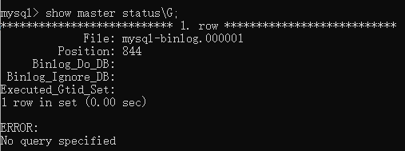

# MySQL主从配置

## 目录

- [1. 部署版本](#1-部署版本)
- [2. 压缩包安装](#2-压缩包安装)
- [3. 主从配置](#3-主从配置)
  - [3.1 主从说明](#31-主从说明)
  - [3.2 master配置](#32-master配置)
  - [3.3 slave配置](#33-slave配置)
  - [3.4 测试](#34-测试)
- [4. 其它说明](#4-其它说明)
  - [4.1 slave报错](#41-slave报错)
  - [4.2 slave设置只读](#42-slave设置只读)
  - [4.3 指定同步数据库](#43-指定同步数据库)

## 1. 部署版本

- Windows10
- MySQL 8.0.20
- 一主两从，主使用MySQL Installer安装，从使用MySQL Community Server压缩包安装

## 2. 压缩包安装

1. 解压压缩包，在bin文件夹同级目录下创建`my.ini`文件，内容如下：
   ```
   [client]
   port=3307
   
   [mysqld]
   # The TCP/IP Port the MySQL Server will listen on
   port=3307
   
   # Path to installation directory. All paths are usually resolved relative to this.
   basedir="C:/Tools/MySQL/MySQL Server 8.0 S0/"
   
   # Path to the database root
   datadir=C:/ToolsData/MySQL/MySQL Server 8.0 S0/Data
   
   # The default authentication plugin to be used when connecting to the server
   default_authentication_plugin=caching_sha2_password
   
   # The default storage engine that will be used when create new tables when
   default-storage-engine=INNODB
   
   # The maximum amount of concurrent sessions the MySQL server will
   # allow. One of these connections will be reserved for a user with
   # SUPER privileges to allow the administrator to login even if the
   # connection limit has been reached.
   max_connections=151
   
   # If more than this many successive connection requests from a host are interrupted without a successful connection,
   # the server blocks that host from performing further connections.
   max_connect_errors=100
   
   sql_mode=STRICT_TRANS_TABLES,NO_ENGINE_SUBSTITUTION
   ```
   注意修改port(端口)、basedir(安装目录)、datadir(数据目录)，目录必须已存在

2. 以管理员身份运行命令提示符，进行以下步骤：

   - 进入安装目录bin目录
   ```
   cd C:\Tools\MySQL\MySQL Server 8.0 S0\bin
   ```

   - 初始化MySQL
   ```
   mysqld --initialize-insecure
   或
   mysqld --initialize
   
   说明：--initialize-insecure创建的root用户无密码；--initialize有密码，需保存密码
   ```

   - 安装MySQL服务
   ```
   mysqld --install MySQL80S0 --defaults-file="C:\Tools\MySQL\MySQL Server 8.0 S0\my.ini"
   
   说明：mysqld --install 服务名 --defaults-file="配置文件"
   ```

   - 启动服务
   ```
   net start MySQL80S0
   
   说明：net start 服务名
   ```

   - 修改root密码
   ```
   mysqladmin -u root -p password
   
   说明：回车之后输入原密码和新密码
   ```

   - 两个MySQL从服务按以上步骤安装及启动

## 3. 主从配置
### 3.1 主从说明

- 一主：服务名MySQL80，端口3306
- 两从：服务名MySQL80S0、MySQL80S1，端口3307、3308
- 主从数据库版本和数据要一致，否则可能出现一些问题

### 3.2 master配置

- 编辑my.ini文件，增加或修改以下配置，重启服务：
  ```
  # 开启binlog
  log-bin="mysql-binlog"
  # 设置server-id，唯一，不能与其它MySQL服务相同
  server-id=1
  # binlog日志保留的天数，清除超过10天的日志
  # 防止日志文件过大，导致磁盘空间不足
  expire-logs-days=10
  ```

- 登入root用户
  ```
  mysql -u root -p
  ```

- 创建用户slave并授权，用于从节点连接主节点
  ```
  create user 'slave'@'localhost' identified with mysql_native_password by 'slave';
  grant replication slave on *.* to 'slave'@'localhost';
  flush privileges;
  
  说明：
  create user '用户名' identified with mysql_native_password by '密码';
  注意创建用户的密码规则为：mysql_native_password
  ```

- 查看master信息
  ```
   show master status\G;
  ```

  

- 上图File和Position在之后需要用到，至此主节点配置完成

### 3.3 slave配置

- 编辑my.ini文件，增加或修改以下配置，重启服务：
  ```
  # 设置server-id，唯一，不能与其它MySQL服务相同
  server-id=2
  ```

- 登入root用户
  ```
  mysql -u root -p
  ```

- 设置主节点参数
  ```
  change master to
  master_host='localhost',
  master_user='slave',
  master_password='slave',
  master_log_file='mysql-binlog.000001',
  master_log_pos=844,
  master_port=3306;
  
  说明：
  change master to
  master_host='主节点ip',
  master_user='创建的用户名',
  master_password='创建的用户密码',
  master_log_file='主节点binlog日志名称',
  master_log_pos=主节点binglog日志偏移量,
  master_port=主节点端口;
  ```

- 启动slave服务
  ```
  start slave;
  ```

- 查看slave信息
  ```
  show slave status\G;
  ```

  

- 上图可以看到master信息，Slave_IO_Running和Slave_SQL_Running均已启动，说明配置成功

### 3.4 测试
在master创建数据库demo、数据库表test并插入数据，在slave可同步到新增数据库、数据库表及数据，说明主从配置成功。

## 4. 其它说明
### 4.1 slave报错
可能在主从配置时主从数据库及数据不一致导致的。注意：slave报错后将不会继续同步。

1. 解决方法1：先停止slave，设置SQL_SLAVE_SKIP_COUNTER值，再启动slave。
   ```
   stop slave;
   set global sql_slave_skip_counter=1;
   start slave;
   ```
   sql_slave_skip_counter表示启动slave时跳过上次执行成功后master几次操作，这里设置为1即表示跳过上次执行成功后1次操作，也就是把出错的操作跳过了。注意，此处如果设置太大将跳过正常操作，导致主从数据不一致。

   执行后如果继续报错则继续执行以上操作，直到slave正常，即Slave_SQL_Running显示为Yes。

2. 解决方法2：手动同步主从数据，slave重新配置master信息，再启动slave

   - 该过程中需要先禁止master写操作，在master输入以下语句：
   ```
   flush tables with read lock;
   ```
   此时数据库的写操作被阻塞，读操作正常执行。

   - 停止slave
   ```
   stop slave;
   ```

   - 导出master数据并同步到slave

   - 在master上查看master信息
   ```
   show master status\G;
   ```

   - 在slave上重新配置master信息，注意修改master_log_file和master_log_pos
   ```
   change master to
     master_log_file='mysql-binlog.000001',
     master_log_pos=1844;
   ```

   - 启动slave
   ```
   start slave;
   ```

   - master解锁
   ```
   unlock tables;
   ```

### 4.2 slave设置只读
在my.ini中添加以下配置，重启服务：

```
read_only=on
# 或
# 管理员权限的用户也只读
# super_read_only=on
```

### 4.3 指定同步数据库
可以在master的my.ini中配置，但这里将增加master过滤操作负载：

```
binlog-do-db='需要同步的数据库名，多个重复该项'
binlog-ignore-db='不需要同步的数据库名，多个重复该项'
```

也可以在slave的my.ini中配置：

```
replicate-do-db='需要同步的数据库名，多个重复该项'
replicate-ignore-db='不需要同步的数据库名，多个重复该项'
```

如果都没指定则同步所有数据库
