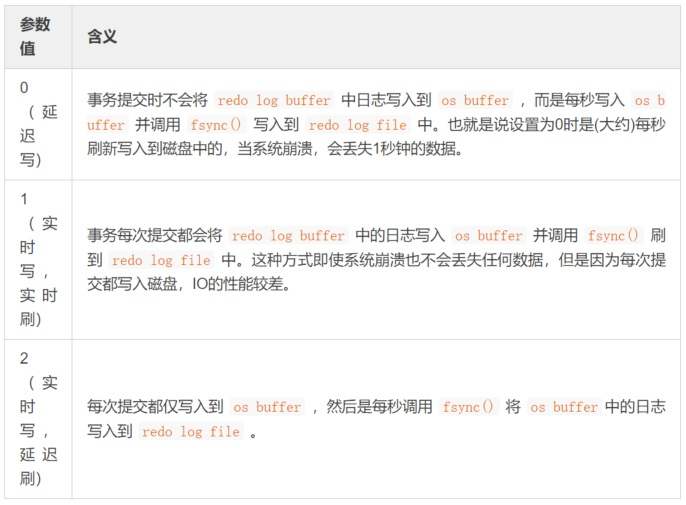

# MySQL三大日志：binlog、redo log和undo log

## 目录

- [1. binlog](#1-binlog)
  - [1.1 binlog基本概念](#11-binlog基本概念)
  - [1.2 binlog使用场景](#12-binlog使用场景)
  - [1.3 binlog刷盘时机](#13-binlog刷盘时机)
  - [1.4 binlog日志格式](#14-binlog日志格式)
- [2. redo log](#2-redo-log)
  - [2.1 为什么需要redo log](#21-为什么需要redo-log)
  - [2.2 redo log基本概念](#22-redo-log基本概念)
  - [2.3 redo log记录形式](#23-redo-log记录形式)
  - [2.4 redo log与binlog的区别](#24-redo-log与binlog的区别)
- [3. undo log](#3-undo-log)
  - [3.1 undo log作用](#31-undo-log作用)

## 1. binlog
### 1.1 binlog基本概念
binlog用于记录数据库执行的写入性操作(不包括查询)信息，以二进制的形式保存在磁盘中。binlog是MySQL的逻辑日志，并且由Server层进行记录，使用任何存储引擎的MySQL数据库都会记录binlog日志。

- 逻辑日志：简单理解就是sql语句。
- 物理日志：MySQL数据最终是保存在数据页中的，物理日志记录的就是数据页变更。

binlog是通过追加的方式进行写入的，可以通过`max_binlog_size`参数设置每个binlog文件的大小，当文件达到给定值之后，会生成新的文件来保存日志。

### 1.2 binlog使用场景
在实际应用中，binlog的主要使用场景是主从复制和数据恢复。

1. 主从复制：在Master端开启binlog，然后将binlog发送到各个Slave端，Slave端重放binlog从而达到主从数据一致。
2. 数据恢复：通过使用`mysqlbinlog`工具来恢复数据。

### 1.3 binlog刷盘时机
对于InnoDB存储引擎而言，只有在事务提交时才会记录binlog，此时记录还在内存中，那么binlog是什么时候刷到磁盘中的呢？

MySQL通过`sync_binlog`参数控制binlog的刷盘时机，取值范围是`0-N`：

- 0：不去强制要求，由系统自行判断何时写入磁盘。
- 1：每次commit的时候都要将binlog写入磁盘。
- N：每N个事务，才会将binlog写入磁盘。

从上面可以看出，`sync_binlog`最安全的设置是`1`，这也是MySQL 5.7.7之后版本的默认值。但是设置一个大一些的值可以提高数据库性能，因此实际情况下也可以将值适当调大，牺牲一定的一致性来获取更好的性能。

### 1.4 binlog日志格式
binlog日志有三种格式：`STATEMENT`、`ROW`和`MIXED`。

在MySQL 5.7.7之前，默认的格式是`STATEMENT`，之后默认值是`ROW`。日志格式通过`binlog_format`指定。

- `STATEMENT`：基于sql语句的复制(`statement-based replication, SBR`)，每一条会修改数据的sql语句会记录到binlog中。
  - 优点：不需要记录每一行的变化，减少了binlog日志量，节约了IO，从而提高了性能。
  - 缺点：在某些情况下会导致主从数据不一致，比如执行sysdate()、sleep()等。
- `ROW`：基于行的复制(`row-based replication, RBR`)，不记录每条sql语句的上下文信息，仅需记录哪条数据被修改了。
  - 优点：不会出现某些特定情况下的存储过程、function或trigger的调用和触发无法被正确复制的问题。
  - 缺点：会产生大量的日志，尤其是`alter table`的时候会让日志暴涨。
- `MIXED`：基于`STATEMENT`和`ROW`两种模式的混合复制(`mixed-based replication, MBR`)，一般的复制使用`STATEMENT`模式保存binlog，对于`STATEMENT`模式无法复制的操作使用`ROW`模式保存binlog。

## 2. redo log
### 2.1 为什么需要redo log
事务的四大特性里面有一个是持久性，具体来说就是只要事务提交成功，那么对数据库做的修改就被永久保存下来了，不可能因为任何原因再回到原来的状态。

那么MySQL是如何保证一致性的呢？

最简单的做法是在每次事务提交的时候，将该事务涉及修改的数据页全部刷新到磁盘中。但是这么做会有严重的性能问题，主要体现在两个方面：

1. 因为InnoDB是以页为单位进行磁盘交互的，而一个事务很可能只修改一个数据页里面的几个字节，这个时候将完整的数据页刷到磁盘的话，太浪费资源。
2. 一个事务可能涉及修改多个数据页，并且这些数据页在物理上并不连续，使用随机IO写入性能太差。

因此MySQL设计了redo log，具体来说就是只记录事务对数据页做了哪些修改，这样就能完美地解决性能问题了(相对而言文件更小并且是顺序IO)。

### 2.2 redo log基本概念
redo log包括两部分：一个是内存中的日志缓冲(`redo log buffer`)，另一个是磁盘上的日志文件(`redo log file`)。

MySQL每执行一条DML语句，先将记录写入`redo log buffer`，后续某个时间点再一次性将多个操作记录写到`redo log file`。这种先写日志，再写磁盘的技术就是MySQL里经常说到的`WAL(Write-Ahead Logging)`技术。

在计算机操作系统中，用户空间(`user space`)下的缓冲区数据一般情况下是无法直接写入磁盘的，中间必须经过操作系统内核空间(`kernel space`)缓冲区(`OS Buffer`)。

因此，`redo log buffer`写入`redo log file`实际上是先写入`OS Buffer`，然后再通过系统调用`fsync()`将其刷到`redo log file`中，过程如下：

MySQL支持三种将`redo log buffer`写入`redo log file`的时机，可以通过`innodb_flush_log_at_trx_commit`参数配置，各参数值含义如下：

### 2.3 redo log记录形式
redo log实际上记录数据页的变更，而这种变更记录是没必要全部保存，因此redo log实现上采用了大小固定，循环写入的方式，当写到结尾时，会回到开头循环写日志。如下图：

同时我们很容易得知，在InnoDB中，既有redo log需要刷盘，还有数据页也需要刷盘，redo log存在的意义主要就是降低对数据页刷盘的要求。

在上图中，`write pos`表示redo log当前记录的`LSN`(逻辑序列号)位置，`check point`表示数据页更改记录刷盘后对应redo log所处的`LSN`位置。

`write pos`到`check point`之间的部分是redo log空着的部分，用于记录新的记录；`check point`到`write pos`之间是redo log待落盘的数据页更改记录。当`write pos`追上`check point`时，会先推动`check point`向前移动，空出位置再记录新的日志。

启动InnoDB的时候，不管上次是正常关闭还是异常关闭，总是会进行恢复操作。因为redo log记录的是数据页的物理变化，因此恢复的时候速度比逻辑日志(如binlog)要快很多。

重启InnoDB时，首先会检查磁盘中数据页的`LSN`，如果数据页的`LSN`小于日志中的`LSN`，则会从`check point`开始恢复。

还有一种情况，在宕机前正处于`check point`的刷盘过程，且数据页的刷盘进度超过了日志页的刷盘进度，此时会出现数据页中记录的`LSN`大于日志中的`LSN`，这时超出日志进度的部分将不会重做，因为这本身就表示已经做过的事情，无需再重做。

### 2.4 redo log与binlog的区别

由binlog和redo log的区别可知：binlog日志只用于归档，只依靠binlog是没有`crash-safe`能力的。

但只有redo log也不行，因为redo log是InnoDB特有的，且日志上的记录落盘后会被覆盖掉。因此需要binlog和redo log二者同时记录，才能保证当数据库发生宕机重启时，数据不会丢失。

## 3. undo log
### 3.1 undo log作用
数据库事务四大特性中有一个是原子性，具体来说就是原子性是指对数据库的一系列操作，要么全部成功，要么全部失败，不可能出现部分成功的情况。

实际上，原子性底层就是通过undo log实现的。undo log主要记录了数据的逻辑变化，比如一条INSERT语句，对应一条DELETE的undo log，对于每个UPDATE语句，对应一条相反的UPDATE的undo log，这样在发生错误时，就能回滚到事务之前的数据状态。

同时，undo log也是`MVCC`(多版本并发控制)实现的关键。
